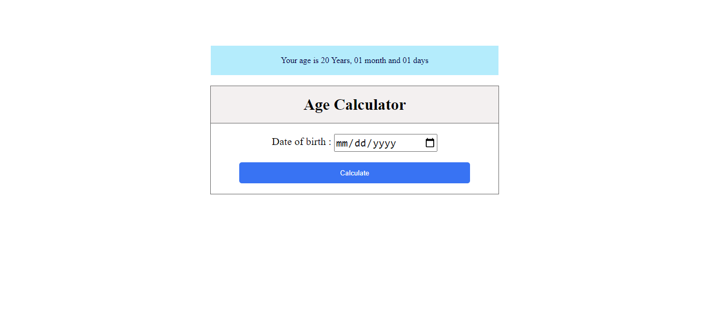

# Tutorial 03

## Calculate your age using ‌age calculator.
## Validation Rules
- required
- date must not greater than or equal tomorrow
- date must be valid format mm/dd/yyyy

## Folder Structure

```
.
├── ccs/
│   ├── reset.css
│   └── style.css
├── demo/
│   └── preview.png
├── libs
├── index.php
└── README.md
```

